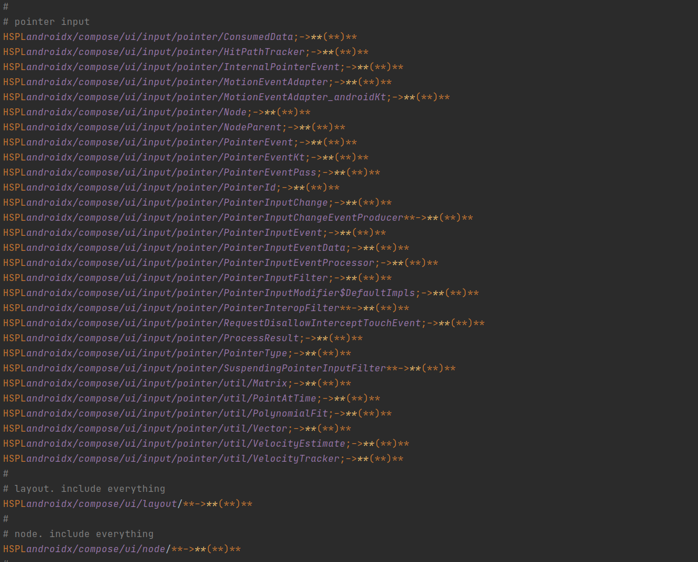
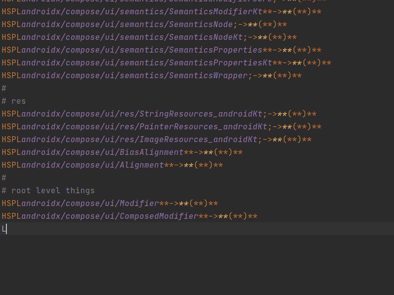

# Android Baseline Profiles

## Features

* Annotate `baseline-prof.txt` files.
* Module aware completion for Kotlin and Java Files for Class descriptors.

### Annotate `baseline-prof.txt` files.

### Module aware class file completions

# Plugin Description

<!-- Plugin description -->
An IntelliJ based plugin to help annotate and author Android Baseline Profile rules.
<!-- Plugin description end -->
